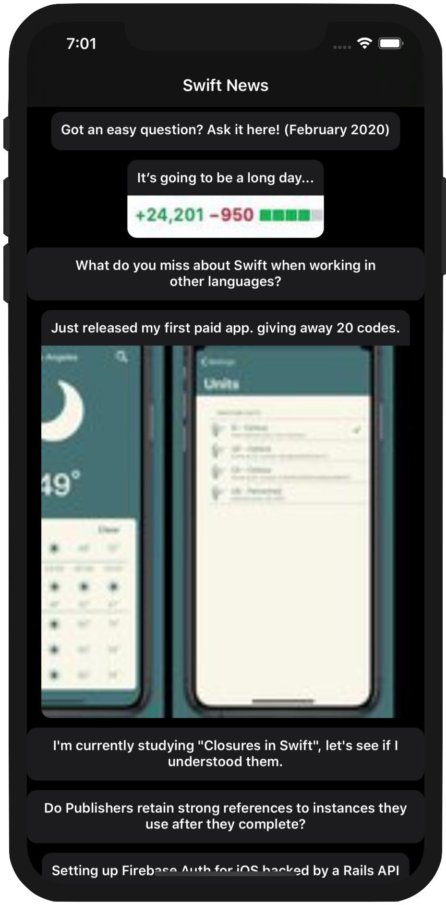
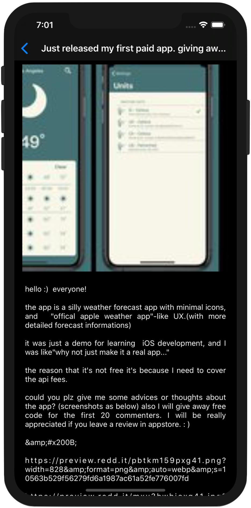

<!-- Header -->

	
	<h1>Swift News App</h1>

  
  
  

<!-- Body -->
## Frameworks / External dependencies
None

## Description
This short project ingests 'Swift News' JSON feed from Reddit, displaying the results in a CollectionView with the ability to tap into the full article. CollectionView cells are able to accommodate and image preserving its aspect ratio and on the cases where the cell is just text the cell shrinks to the size of the title. Both ViewControllers are embedded inside a NavigationController showing the article's title on the details ViewController's title.

No third party dependencies have been used on this project.

## App preview
Those are the most relevant screenshots showing the overall result of the project.

  
  
  

<!-- Footer -->