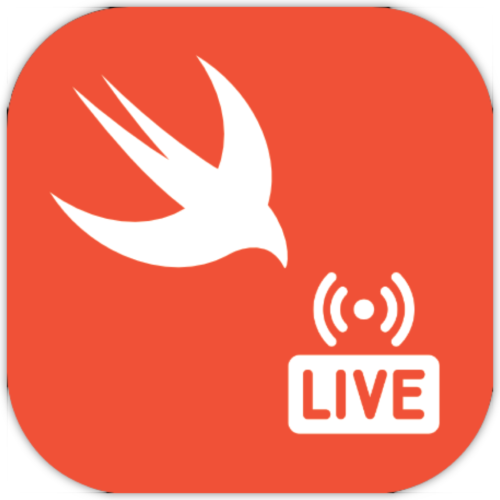

<!-- HEADER -->

<h1>Swift News App</h1>

[][Swift]
[][iOS]
[][Twitter]

<!-- BODY -->
## Frameworks/External dependencies
- Foundation
- UIKit

## Description
This app **ingests the 'Swift News' JSON feed from Reddit, displaying the results in a collection-view** with the ability to tap into the full article. **Collection-view cells are able to accommodate and image**, preserving its aspect ratio, and on the cases **where the cell is just text it shrinks to the size of the title**. Both view-controllers are embedded inside a navigation-controller showing the article's title on the details view-controller's title.

No third party dependencies have been used on this project.

## Preview
Those are the most relevant screenshots of the project.

	
	
	

<!-- FOOTER -->
<!-- Permanent links -->
[Swift]: https://www.swift.org
[iOS]: https://developer.apple.com/ios/
[Twitter]: https://twitter.com/BEstelrich